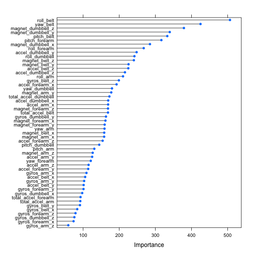

# Coursera Machine Learning Project

Using devices such as Jawbone Up, Nike FuelBand, and Fitbit it is now possible to collect a large amount of data about personal activity relatively inexpensively. These type of devices are part of the quantified self movement – a group of enthusiasts who take measurements about themselves regularly to improve their health, to find patterns in their behavior, or because they are tech geeks. One thing that people regularly do is quantify how much of a particular activity they do, but they rarely quantify how well they do it. In this project, your goal will be to use data from accelerometers on the belt, forearm, arm, and dumbell of 6 participants. They were asked to perform barbell lifts correctly and incorrectly in 5 different ways. More information is available from the website here: http://groupware.les.inf.puc-rio.br/har (see the section on the Weight Lifting Exercise Dataset).

## Modeling

In order to provide consistent data to construct features, the first task was to sanitize the data.  The following steps where taken:

1.  Remove excel division error strings `#DIV/0!` and replace with `NA` values.
1.  Convert empty strings to `NA` values.

## Feature Selection

With a clean data set, the next task was to explore the data and determine what is likely useful information.  An important goal of any model to generalize well with unseen data.  Given this,

1.  Any features that contained NA values were removed.
1.  Several columns appeared to be entirely metadata.  These columns were dropped as any correlation that exists would likely be spurious and therefore cause the model to perform poorly.

The following fields removed included:

* the unlabled row index
* `user_name`
* `raw_timestamp_part_1`
* `raw_timestamp_part_2`
* `cvtd_timestamp`
* `new_window`
* `num_window`

## Cross Validation

Cross validation was achieved by splitting the training data into a test set and a training set using the following:


```r
in.train <- createDataPartition(training.features$classe, p=.60, list=FALSE)

train <- training.features[in.train[,1]]
test <- training.features[-in.train[,1]]
```

The data was partioned by the `classe` variable to ensure the training set and test set contain examples of each class. 60% of the training data was allocated to the training set and the remainder for the validation set.

## Prediction

The random forest model was initially used to prediction.


```
## Confusion Matrix and Statistics
## 
##           Reference
## Prediction    A    B    C    D    E
##          A 2229    3    0    0    0
##          B    3 1511   12    0    1
##          C    0    4 1356   37    0
##          D    0    0    0 1246    2
##          E    0    0    0    3 1439
## 
## Overall Statistics
##                                         
##                Accuracy : 0.992         
##                  95% CI : (0.989, 0.994)
##     No Information Rate : 0.284         
##     P-Value [Acc > NIR] : <2e-16        
##                                         
##                   Kappa : 0.99          
##  Mcnemar's Test P-Value : NA            
## 
## Statistics by Class:
## 
##                      Class: A Class: B Class: C Class: D Class: E
## Sensitivity             0.999    0.995    0.991    0.969    0.998
## Specificity             0.999    0.997    0.994    1.000    1.000
## Pos Pred Value          0.999    0.990    0.971    0.998    0.998
## Neg Pred Value          0.999    0.999    0.998    0.994    1.000
## Prevalence              0.284    0.193    0.174    0.164    0.184
## Detection Rate          0.284    0.193    0.173    0.159    0.183
## Detection Prevalence    0.284    0.195    0.178    0.159    0.184
## Balanced Accuracy       0.999    0.996    0.992    0.984    0.999
```

It's estimated that the out of sample error would reflect the Kappa statistic of 0.9895.

### Variable Importance

 

## Conclusion

The random forest algorithm appears to perform very well for predicting activities from accelerometers measurements.
